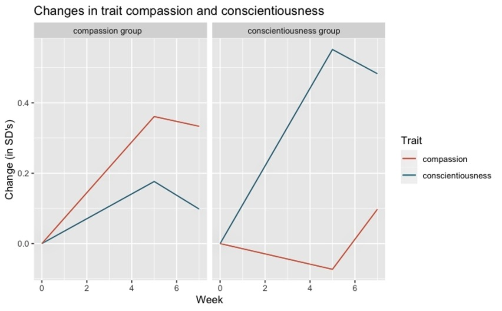
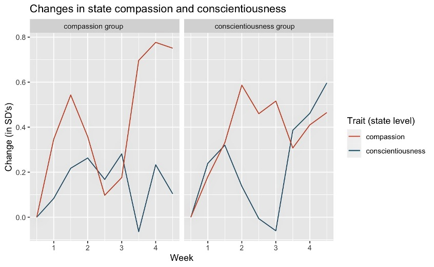

```{r setup, include=FALSE}
knitr::opts_chunk$set(echo=TRUE)
```

This is part 5 of the analyses for my master's thesis project, which was titled "Effects of a Short-Term Volitional Intervention Promoting Moral and Non-Moral Personality Change." Here is the abstract of my thesis for some context:

> People can intentionally change specific personality traits. However, it is unclear whether such interventions are effective at changing moral character traits. The present study (total N = 179), which utilized two active intervention groups for mutual comparisons, examined whether a 5-week goal-setting intervention could lead to trait change for a moral trait, compassion (n = 87), or the Big 5 trait of conscientiousness (n = 92). Participants self-selected into one condition after getting feedback on where they stood on these traits in relation to the population norm and completing a brief reflection task. They set implementation intentions and reflected on their progress every 3 days for the duration of the intervention. State assessments were collected every 3 days in addition to self- and observer-report trait assessments at pre- and post-test, with follow-up self-report assessments 2 weeks post-program. Results from analyses of self-report trait and state assessments indicated that participants in both intervention groups were able to successfully change their personalities in the short term, providing preliminary evidence that implementation intention-based volitional personality change interventions can be useful tools for both moral and non-moral trait change.

Here, I am attempting to make some figures (or one comprehensive figure) to represent the overall effects from my thesis study. I wanted to try making more simple/straightforward figures before attempting to make any figures that captured the multilevel nature of my data.

This was one of my first few times making figures with ggplot, so I was very much still learning the ropes!

### Loading Packages and Data

```{r load-packages-data}

library(foreign)
library(tidyverse)

VPCDescriptives = read.spss("VPCdescriptives_2.21.23.sav",
                      to.data.frame = TRUE,
                      reencode = TRUE,
                      use.value.labels = FALSE)

VPCDescriptives_trait <- filter(VPCDescriptives, datalevel == 1)
CompDesc_trait <-filter(VPCDescriptives_trait, intervention == 0)
ConsDesc_trait <-filter(VPCDescriptives_trait, intervention == 1)

VPCDescriptives_state <- filter(VPCDescriptives, datalevel == 2)
CompDesc_state <-filter(VPCDescriptives_state, intervention == 0)
ConsDesc_state <-filter(VPCDescriptives_state, intervention == 1)


VPCDescriptives_trait$intervention <- as.factor(VPCDescriptives_trait$intervention)

VPCDescriptives_trait$intervention_label <- as.factor(VPCDescriptives_trait$intervention_label)

VPCDescriptives_state$intervention <- as.factor(VPCDescriptives_trait$intervention)

VPCDescriptives_state$intervention_label <- as.factor(VPCDescriptives_state$intervention_label)

VPCDescriptives$intervention <- as.factor(VPCDescriptives$intervention)

VPCDescriptives$intervention_label <- as.factor(VPCDescriptives$intervention_label)

VPCDescriptives$datalevel <- as.factor(VPCDescriptives$datalevel)


```

------------------------------------------------------------------------

### Trait Changes Plot (Initial)

```{r trait-changes-plot}

## My very first attempt at trying to make this plot:

# ggplot(data = VPCtrait, 
#        mapping = aes(x = LinearTime, 
#                      y = conscientiousness)) +
#   geom_col() +
#   labs(title = "Changes in conscientiousness",
#        subtitle = "by person",
#        x = "Time point", y = "Trait-level conscientiousness") +
#   scale_fill_brewer(palette = "Set3") +
#   theme(panel.background = element_rect(fill = "white"),
#         panel.grid.major = element_line(size = 0.25, linetype = 'solid',
#                                 color = "grey"),
#         panel.grid.minor = element_line(size = 0.1, linetype = 'solid',
#                                 color = "grey"),
#         axis.ticks = element_blank(),
#         legend.key = element_rect(fill = "white"))


# Here I realized that I could specify different x and y variables for each layer!
# (I still didn't really know how to change colors or line types or anything like that yet.)

TraitChanges <- ggplot(VPCDescriptives_trait, aes(
  x = week, group = intervention_label)) + 
  geom_line(aes(y = cons_changeinSD, color = "conscientiousness")) +
  geom_line(aes(y = comp_changeinSD, color = "compassion")) +
  labs(title = "Changes in trait compassion and conscientiousness",
       # subtitle = "for participants in the conscientiousness group",
       x = "Week", y = "Change (in SD's)") +
# xlim(0, 7) +
#   ylim (0, 0.8) +
     facet_wrap(~ intervention_label)

TraitChanges + scale_color_discrete(name = "Trait")


# I wanted to figure out how to change the x axis scale here, but I couldn't figure it out. 

# + 
#   scale_x_discrete(labels = c("1" = "Pretest (W1)", "11" = "Posttest (W11)", "12" = "Follow-Up (W12)",
#     breaks = c("1", "11", "12")))

```

### State Changes Plot (Initial)

```{r state-changes}
StateChanges <- ggplot(VPCDescriptives_state, aes(
  x = week, group = intervention_label)) + 
  geom_line(aes(y = cons_changeinSD, color = "conscientiousness")) +
  geom_line(aes(y = comp_changeinSD, color = "compassion")) +
  labs(title = "Changes in state compassion and conscientiousness",
       # subtitle = "for participants in the conscientiousness group",
       x = "Week", y = "Change (in SD's)") +
     facet_wrap(~ intervention_label) 
# xlim(0, 7) +
#   ylim (0, 0.8)

# ^ Still attempting to figure out how to change x and y axis scales here and couldn't figure it out.

StateChanges + scale_color_discrete(name = "Trait (state level)")
```

### Combined Trait and State Changes Plot (Initial)

I ended up using versions of the above two plots for my SWell presentation on 2/15/23. Because I hadn't figured out how to change the colors, yet, I literally just put my figure images into Photoshop and changed it that way 🙃

Here are those plots (the state-level data I was using here was wrong for some reason---I fixed everything after my SWell presentation before my SPSP presentation):

```{r photoshopped-plots}





```

Then, right after my presentation, before I implemented the main changes that people had suggested (but after cleaning up my datasets), I figured out a way I liked to put both state and trait growth patterns on the same graph:

```{r state-and-trait-changes}

# Here I was still experimenting with where to put color changes. I couldn't figure out how to change it from the defaults for some reason!! I spent so many hours on this!

# TraitStateChanges <- ggplot(VPCDescriptives, aes(
#   x = week, group = intervention_label)) + 
#   geom_line(aes(y = cons_changeinSD, color = "conscientiousness (trait)"), color = 'turquoise') +
#   geom_line(aes(y = comp_changeinSD, color = "compassion (trait)"), color =
#               'salmon') +
#   geom_line(aes(y = cons_changeinSD_state, color = "conscientiousness (state("), linetype = "dotted", color = 'turquoise') +
#   geom_line(aes(y = comp_changeinSD_state, color = "compassion (trait)"),
#             linetype = "dotted", color = 'salmon') +
#   labs(title = "Changes in trait and state compassion and conscientiousness",
#        # subtitle = "for participants in the conscientiousness group",
#        x = "Week", y = "Change (in SD's)") +
#      facet_wrap(~ intervention_label)
# 
# TraitStateChanges + scale_color_discrete(name = "Trait") 
#   scale_color_manual(
#       values = c(
#            compassion (trait) ="salmon",
#             compassion (state) ="salmon",
#           conscientiousness (trait) = "turquoise"
#           conscientiousness (state) = "turquoise"))


# Here I realized that you can use different datasets for different layers! Which was helpful.


TraitStateChanges <- ggplot() + 
  geom_line(data = VPCDescriptives_trait, aes(x = week, y = cons_changeinSD), color = '#10C0C5') +
  geom_line(data = VPCDescriptives_trait, aes(x = week, y = comp_changeinSD), color =
              '#F7766D') +
  geom_line(data = VPCDescriptives_state, aes(x = week, y = cons_changeinSD), linetype = "dotted", color = '#10C0C5') +
  geom_line(data = VPCDescriptives_state, aes(x = week, y = comp_changeinSD),
            linetype = "dotted", color = '#F7766D') +
  labs(title = "Changes in trait and state compassion and conscientiousness",
       # subtitle = "for participants in the conscientiousness group",
       x = "Week", y = "Change (in SD's)") +
     facet_wrap(~ intervention_label)

TraitStateChanges + scale_color_discrete(name = "Trait")
                                         # labels = c("conscientiousness (trait)",
                                         #            "compassion (trait)",
                                         #            "conscientiousness (state)",
                                         #            "compassion (state)")) 


```

This solved the problem people had pointed out about having two different x axis scales for the trait and state graphs. 
