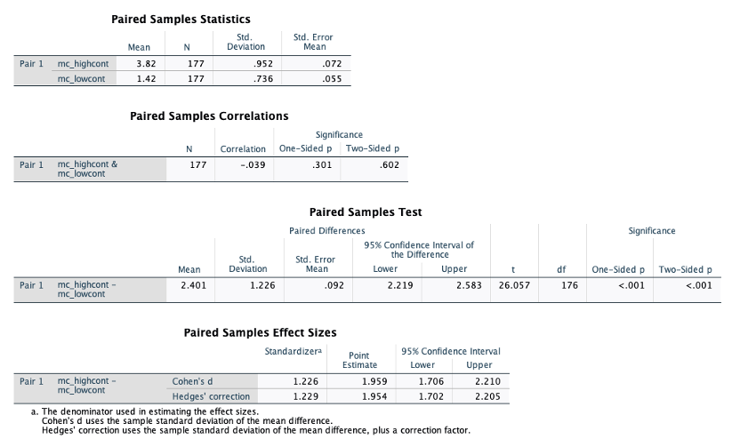
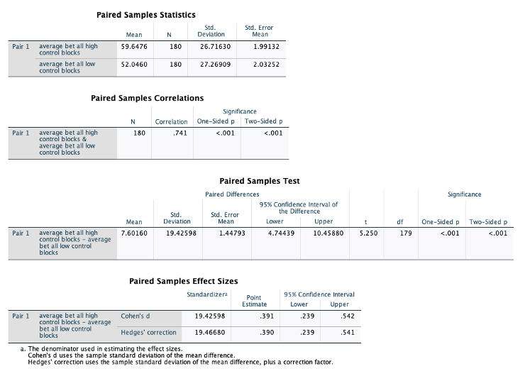
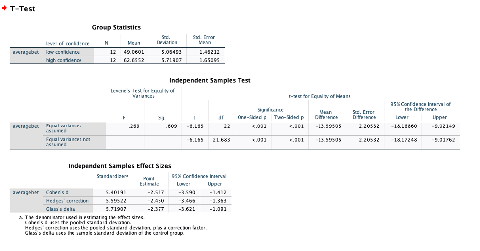
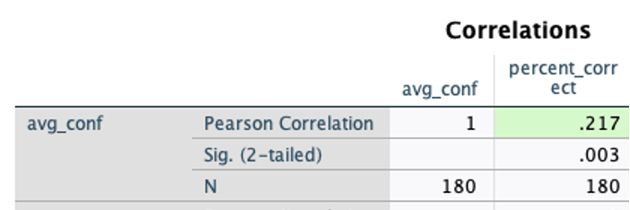
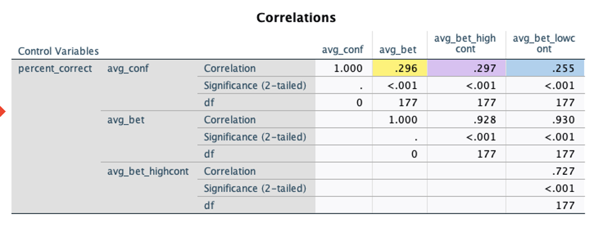

### Introduction

This project (like portfolio pieces 8-10) is from my work on an NSF-funded grant on the consequences of confidence with Dr. Eric Stone (Wake Forest University) and Dr. Andrew Parker (RAND corporation). This study aimed to investigate the effects of a moderator of interest, level of environmental control, on the relationship between unjustified confidence (i.e., confidence controlling for knowledge) and risk taking behavior within the domain of the game blackjack.

First I will give an overview of the study design, our hypotheses, and our main analyses, which I mostly ran in SPSS (per Dr. Stone's preference). Then, I will show the plots I constructed using ggplot, which helped to show what was happening in the study at a more granular level. 

#### Study design:

This study will follow a within-subjects design. First, all participants will complete a knowledge-confidence assessment (KCA), in which they will be tested on their knowledge of blackjack strategy (e.g., in which cases it makes the most sense to hit or stand) and how confident they are in that knowledge (on a scale from 50%, just guessing, to 100%, completely sure). Next, all participants will play a computerized blackjack game and will experience alternating blocks of rounds in which they have a high level of control (i.e., they make their own play and betting decisions) and a low level of control (i.e., the computer makes their play decisions for them, but they still make their own bets). Participants will be randomly assigned to either one of two orders: high control play first or low control play first.

#### Hypotheses:

1. Unjustified confidence (i.e., confidence controlling for knowledge) will be positively correlated with risk-taking (i.e., average amount bet). 

2. The level of control over outcomes that a participant has (i.e., whether they are able to make their own play decision) will act as a moderator between unjustified confidence and risk-taking. Specifically, the relationship between unjustified confidence and risk-taking will be stronger when participants have a high level of control over outcomes (i.e., when they are able to make their own play decisions).

### Loading Packages and Data

```{r load-packages-data}
library(cocor)
library(foreign)
library(tidyverse)

########

blackjack = read.spss("all blackjack data 12.13.22.sav",
                      to.data.frame = TRUE,
                      reencode = TRUE,
                      use.value.labels = FALSE)

blackjack$condition <- as.factor(blackjack$condition)

blackjack_highfirst <- filter(blackjack, condition == 1)
blackjack_lowfirst <- filter(blackjack, condition == 2)

#####

blackjack_averages = read.spss("blackjack_btwnavgs.sav",
                      to.data.frame = TRUE,
                      reencode = TRUE,
                      use.value.labels = FALSE)

blackjack_averages$order <- as.factor(blackjack_averages$order)
blackjack_averages$block <- as.factor(blackjack_averages$block)

blackjack_avg_highfirst <- filter(blackjack_averages, order == 1)
blackjack_avg_lowfirst <- filter(blackjack_averages, order == 2)


#########

blackjack_avg_wconf = read.spss("blackjack_btwnavgs_wconf.sav",
                      to.data.frame = TRUE,
                      reencode = TRUE,
                      use.value.labels = FALSE)

blackjack_avg_wconf$order <- as.factor(blackjack_avg_wconf$order)
blackjack_avg_wconf$block <- as.factor(blackjack_avg_wconf$block)
blackjack_avg_wconf$level_of_confidence <- as.factor(blackjack_avg_wconf$level_of_confidence)


blackjack_avg_highfirstconf <- filter(blackjack_avg_wconf, order == 1)
blackjack_avg_lowfirstconf <- filter(blackjack_avg_wconf, order == 2)

blackjack_avg_lowconf <- filter(blackjack_avg_wconf, level_of_confidence == 1)
blackjack_avg_highconf <- filter(blackjack_avg_wconf, level_of_confidence == 2)


#########


blackjack_avg_wconfknow = read.spss("blackjack_btwnavgs_wconfknow.sav",
                      to.data.frame = TRUE,
                      reencode = TRUE,
                      use.value.labels = FALSE)

blackjack_avg_wconfknow$order <- as.factor(blackjack_avg_wconfknow$order)
blackjack_avg_wconfknow$block <- as.factor(blackjack_avg_wconfknow$block)
blackjack_avg_wconfknow$level_of_confidence <- as.factor(blackjack_avg_wconfknow$level_of_confidence)
blackjack_avg_wconfknow$level_of_knowledge <- as.factor(blackjack_avg_wconfknow$level_of_knowledge)

know_blackjack_avg_highfirstconf <- filter(blackjack_avg_wconfknow, order == 1)
know_blackjack_avg_lowfirstconf <- filter(blackjack_avg_wconfknow, order == 2)

know_blackjack_avg_lowconf <- filter(blackjack_avg_wconfknow, level_of_confidence == 1)
know_blackjack_avg_highconf <- filter(blackjack_avg_wconfknow, level_of_confidence == 2)

blackjack_avg_lowknow <- filter(blackjack_avg_wconfknow, level_of_knowledge == 1)
blackjack_avg_highknow <- filter(blackjack_avg_wconfknow, level_of_knowledge == 2)


#########

blackjack_highlowavg = read.spss("blackjack_highlowavgs_wconfknow.sav",
                      to.data.frame = TRUE,
                      reencode = TRUE,
                      use.value.labels = FALSE)

blackjack_highlowavg$order <- as.factor(blackjack_highlowavg$order)
blackjack_highlowavg$level_of_confidence <- as.factor(blackjack_highlowavg$level_of_confidence)
blackjack_highlowavg$level_of_knowledge <- as.factor(blackjack_highlowavg$level_of_knowledge)
blackjack_highlowavg$control <- as.factor(blackjack_highlowavg$control)

know_blackjack_highlowavg_highfirstconf <- filter(blackjack_highlowavg, order == 1)
know_blackjack_highlowavg_lowfirstconf <- filter(blackjack_highlowavg, order == 2)

know_blackjack_highlowavg_lowconf <- filter(blackjack_highlowavg, level_of_confidence == 1)
know_blackjack_highlowavg_highconf <- filter(blackjack_highlowavg, level_of_confidence == 2)

blackjack_highlowavg_lowknow <- filter(blackjack_highlowavg, level_of_knowledge == 1)
blackjack_highlowavg_highknow <- filter(blackjack_highlowavg, level_of_knowledge == 2)


#########

blackjack_overallavg = read.spss("blackjack_overallaverages.sav",
                      to.data.frame = TRUE,
                      reencode = TRUE,
                      use.value.labels = FALSE)


blackjack_overallavg$level_of_confidence <- as.factor(blackjack_overallavg$level_of_confidence)
blackjack_overallavg$level_of_knowledge <- as.factor(blackjack_overallavg$level_of_knowledge)
blackjack_overallavg$control <- as.factor(blackjack_overallavg$control)

blackjack_overallavg_lowconf <- filter(blackjack_overallavg, level_of_confidence == 1)
blackjack_overallavg_highconf <- filter(blackjack_overallavg, level_of_confidence == 2)

blackjack_overallavg_lowknow <- filter(blackjack_overallavg, level_of_knowledge == 1)
blackjack_overallavg_highknow <- filter(blackjack_overallavg, level_of_knowledge == 2)

```


### Main Analyses

#### 1. Manipulation checks and assumptions (did our manipulations work as we intended them to?)

**1.	Level of control (did participants feel as though they were “in control” in the high control condition, and “not in control” in the low control condition?)**

Our manipulation check for this was a two-question survey participants filled out when they were finished playing the blackjack game. A paired samples t-test comparing people’s ratings of the two conditions was significant:

```{r 1-1}

```

***Conclusion for manipulation check/assumption 2:*** Our assumption that participants would generally bet more when they felt they had more control was correct. 

-------------

**2.	Relationship between level of control and risk taking (did participants generally bet more money in the high control condition as opposed to the low control condition?)**


We assumed that, in general, participants would bet more in the high control condition as opposed to the low control condition. Here are the results of a paired samples t-test comparing average amount bet across all high control blocks as opposed to average amount bet across all low control blocks:

```{r 1-2}

```

***Conclusion for manipulation check/assumption 2:*** Our assumption that participants would generally bet more when they felt they had more control was correct.

-------------

**3.	Relationship between level of confidence and risk taking (did highly confident participants generally bet more than lowly confident participants?)**

Looking at this question with confidence as a dichotomous variable: 

```{r 1-3}

```

***Conclusion for manipulation check/assumption 3:*** Our assumption that participants would generally bet more when they had more confidence was correct. 

-------------

**4.	Relationship between confidence and knowledge (a general assumption of this line of work: confidence and knowledge should be positively correlated)**

For all participants, confidence and knowledge (percent correct) were positively correlated with each other:

```{r 1-4}

```

***Conclusion for manipulation check/assumption 4:*** Our assumption that confidence would be positively correlated with knowledge was correct. 


#### 2. Answers to our hypotheses 

**1.	Unjustified confidence (i.e., confidence controlling for knowledge) will be positively correlated with risk taking (i.e., average amount bet).**


```{r 2-1}

```

***Conclusion for Hypothesis 1:*** Hypothesis 1 was supported: unjustified confidence was positively correlated with risk taking (r = .30). 


**2.	The relationship between unjustified confidence and risk taking will be stronger for the high control condition.**

I tested for significant differences between the correlations for the two different levels of control with the [cocor package](http://comparingcorrelations.org/) (Diedenhofen & Musch, 2015):

```{r 2-2}
cocor.dep.groups.overlap(r.jk=+0.297, r.jh=+0.255, r.kh=+0.727, n=180, alternative="greater", alpha=0.05, conf.level=0.95, null.value=0)
```
The correlations between confidence and average bet for high control and average bet for low control looked different (in the expected direction), but upon testing for significance, we found that the two correlations (r = .30 for high control and r = .26 for low control) were not significantly different from each other. Thus, we could not reject the null hypothesis for our second prediction. 


***Conclusion for Hypothesis 2:*** Hypothesis 2 was not supported: the correlation between unjustified confidence and risk taking was not significantly stronger for the high control condition as opposed to the low control condition. 

#### 3. Delving deeper

Since the effect across the high/low control conditions was not as large as we were hoping it would be, we wanted to delve a little deeper into why this might be the case. Did this have something to do with the fact that we had a within- rather than a between-subjects design(i.e., were there order effects)? Would there be different effects if we looked at confidence as a dichotomous rather than a continuous variable? We wanted to answer these questions in order to determine whether it would be worth our time and effort to run a follow-up study to this one. 
**Investigating whether there were order effects**

When looking at graphs with error bars that represent actual confidence intervals (and not just Excel’s automatically created “standard errors”), you can see that there aren’t any significant differences in average amount bet across blocks with different levels of control for both of the order groups (with one exception for blocks 1 and 2 of the low control first group):

```{r figure-1c, fig.height=5, fig.width=7.5}

Figure1c <- ggplot(data = blackjack_averages, aes (x = block, y = averagebet, color = order)) +
geom_point() +
geom_errorbar(aes(ymin = lower, ymax = upper)) +
labs(title = "Average amount bet (risk taking)", subtitle = 'by order group', y="Average $ amount bet") +
facet_wrap( ~ order, 
            labeller = labeller(order = c("1" = "high control first (odd block numbers = high control)",
"2" = "low control first (odd block numbers = low control)"))) +
  scale_color_discrete(labels = c("high control first", "low control first")) +
scale_color_manual(values = c("#809826","#479DA3"), guide=FALSE)

Figure1c

```

There does seem to be more variability in betting amounts across levels of control in the low control first group.

Here is the same plot, but separating out dichotomized levels of confidence as well:

```{r figure-1d, fig.height=5, fig.width=9}


Figure1d <- ggplot() +
  geom_point(data = blackjack_avg_lowconf, aes (x = block, y = averagebet, color = "low confidence")) + 
  geom_errorbar(data = blackjack_avg_lowconf, aes (x = block, y = averagebet, ymin = lower, ymax = upper, color = "low confidence")) +
  geom_point(data = blackjack_avg_highconf, aes (x = block, y = averagebet, color = "high confidence")) + 
  geom_errorbar(data = blackjack_avg_highconf, aes (x = block, y = averagebet, ymin = lower, ymax = upper, color = "high confidence")) +
   labs(title = "Average amount bet (risk taking)", subtitle = 'by order group and level of confidence', y="average $ amount bet", color = 'median-split levels of confidence')+
    facet_wrap(~ order,
               labeller = labeller(order = c("1" = "high control first (odd block numbers = high control)",
"2" = "low control first (odd block numbers = low control)")))  +
      scale_color_manual(values = c("#B04326", "#E0A151"))

Figure1d
```


You can see that there are only a few instances (3) in which bet amounts were significantly different for individuals with high and low confidence. There are no instances in either group where individuals with the same level of confidence bet differently across different levels of control. 


Here is the same plot, but further separated out by a median-split dichotomous knowledge variable (low knowledge is less than or equal to 60% correct on the KCA, high knowledge is greater than 60% correct on the KCA). Controlling for knowledge (i.e., looking just at the “low knowledge” row, or just the ”high knowledge” row), you can see that there are no significant differences in amount bet across blocks for any unique group of individuals:

```{r figure-1e, fig.height=9, fig.width=9}


Figure1e <- ggplot() +
  geom_point(data = know_blackjack_avg_lowconf, aes (x = block, y = averagebet, color = "low confidence")) + 
  geom_errorbar(data = know_blackjack_avg_lowconf, aes (x = block, y = averagebet, ymin = lower, ymax = upper, color = "low confidence")) +
  geom_point(data = know_blackjack_avg_highconf, aes (x = block, y = averagebet, color = "high confidence")) + 
  geom_errorbar(data = know_blackjack_avg_highconf, aes (x = block, y = averagebet, ymin = lower, ymax = upper, color = "high confidence")) +
   labs(title = "Average amount bet (risk taking)", subtitle = 'by order group, level of confidence and level of knowledge', y="average $ amount bet", color = 'median-split levels of confidence')+
    facet_grid(level_of_knowledge ~ order,
               labeller = labeller(order = c("1" = "high control first (odd block numbers = high control)",
"2" = "low control first (odd block numbers = low control)"), level_of_knowledge = c("2" = "high knowledge", "1" = "low knowledge")))  +
      scale_color_manual(values = c("#B04326", "#E0A151"))

Figure1e
```


**Looking at overall effects/interactions (not separating out by individual blocks)**

```{r figure-1g, fig.height=6, fig.width=6}


Figure1g <- ggplot() +
  geom_point(data = blackjack_overallavg_lowconf, aes (x = control, y = averagebet, color = "low confidence")) + 
  geom_errorbar(data = blackjack_overallavg_lowconf, aes (x = control, y = averagebet, ymin = lower, ymax = upper, color = "low confidence")) +
  geom_point(data = blackjack_overallavg_highconf, aes (x = control, y = averagebet, color = "high confidence")) + 
  geom_errorbar(data = blackjack_overallavg_highconf, aes (x = control, y = averagebet, ymin = lower, ymax = upper, color = "high confidence")) +
   labs(title = "Average amount bet (risk taking)", subtitle = 'by level of confidence and level of knowledge', 
        x = "level of control", y="average $ amount bet", color = 'median-split levels of confidence') +
    facet_grid(level_of_knowledge ~  . , 
                labeller = labeller(order = c("1" = "high control first group",
"2" = "low control first group"), level_of_knowledge = c("2" = "high knowledge", "1" = "low knowledge")))  +
      scale_color_manual(values = c("#B04326", "#E0A151")) +
  scale_x_discrete(breaks=c("1","2"),
        labels=c("1" = "low control blocks", "2" = "high control blocks"))


Figure1g
```


This plot also looks at all low control blocks vs. all high control blocks, but sees if there are differences between the high control first group and the low control first group:

```{r figure-1f, fig.height=5, fig.width=7}


Figure1f <- ggplot() +
  geom_point(data = know_blackjack_highlowavg_lowconf, aes (x = control, y = averagebet, color = "low confidence")) + 
  geom_errorbar(data = know_blackjack_highlowavg_lowconf, aes (x = control, y = averagebet, ymin = lower, ymax = upper, color = "low confidence")) +
  geom_point(data = know_blackjack_highlowavg_highconf, aes (x = control, y = averagebet, color = "high confidence")) + 
  geom_errorbar(data = know_blackjack_highlowavg_highconf, aes (x = control, y = averagebet, ymin = lower, ymax = upper, color = "high confidence")) +
   labs(title = "Average amount bet (risk taking)", subtitle = 'by order group, level of confidence and level of knowledge', 
        x = "level of control", y="average $ amount bet", color = 'median-split levels of confidence') +
    facet_grid(level_of_knowledge ~ order, 
                labeller = labeller(order = c("1" = "high control first group",
"2" = "low control first group"), level_of_knowledge = c("2" = "high knowledge", "1" = "low knowledge")))  +
      scale_color_manual(values = c("#B04326", "#E0A151")) +
  scale_x_discrete(breaks=c("1","2"),
        labels=c("1" = "low control blocks", "2" = "high control blocks"))


Figure1f
```


